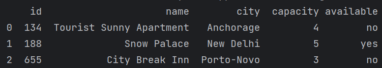
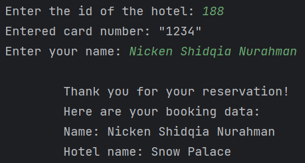

# Build a Hotel Booking App Using Python in OOP Style

## Project Description

**Overview :**  
The Hotel Booking App is a comprehensive reservation system built using Python, employing Object-Oriented Programming (OOP) principles. This application enables users to seamlessly book hotel rooms by entering the hotel ID and their card information.

**Challenges :**  
Build a Hotel Booking App Using Python in Object-Oriented Programming Style.

## Project Goal

The project aims to enables users to check their book hotel rooms by entering the hotel ID and their card information.

## Tools & Library Used

 &nbsp;

## Project Result

[Click here to get full code](https://github.com/nickenshidqia/Build_a_Hotel_Booking_App_Using_Python/blob/4aeee020b91b13de4d584b4aa306f16cfaccd776/main.py)

### Hotel Database :

- Maintain a database of hotels, each identified by a unique ID.
- Include details such as hotel name, location, capacity, and availability.  
    

### Booking System :

- Validate the availability of rooms and confirm the booking by providing a unique hotel ID.
- Integrate a secure payment system for processing card transactions.  
  
